# 📡 Hermes Uplink

A near-universal, data-efficient, text-based "thin client" for [Hermes Agent](https://hermes-agent.nousresearch.com/). Hermes Uplink lets you keep your powerful desktop as the central hub—where all your project files, curated skills, assets, and ML libraries reside—while seamlessly directing complex workflows from any mobile or laptop browser on the go.

Instead of relying on bandwidth-heavy, laggy screen sharing or transferring gigabytes of data to your phone/laptop, Uplink uses a loopback-only proxy behind an HTTPS tunnel. This keeps **all your existing sessions visible and resumable**, provides full tool and skill access, and uses minimal bandwidth.

---

## 💖 Support FOSS Projects

**My work developing, contributing to, and maintaining open-source software is made possible solely by your donations. Your support is vital to the ongoing development of FOSS solutions.**

### 🌟 Other Ways to Help

⭐ **Star the repository** to show your support  
🐦 **Share** to help others discover Hermes Uplink  
📝 **Write reviews** and share your experience  
🎥 **Create content** - tutorials, guides, or showcase videos

---

## Design Principles
- **Zero build steps:** The client is a single vanilla HTML/JS file.
- **Native execution:** Driven by Hermes's first-party API Server running natively on Windows (no WSL2/docker required).
- **Secure architecture:** A loopback-only stdlib proxy keeps the API key on the host desktop; remote access is provided through an HTTPS tunnel.
- **Standalone:** Uplink runs independently of the Hermes-agent and its UI packages, ensuring compatibility across agent upgrades.

## Architecture

```mermaid
flowchart LR
    subgraph EDGE["Edge device (phone / laptop)"]
        B[Browser<br/>index.html<br/>vanilla JS, no build]
    end
    subgraph DESKTOP["Home desktop (Windows, native, NO WSL2)"]
        P[proxy.py<br/>loopback HTTP<br/>key injected server-side]
        A[Hermes gateway<br/>API Server :8642]
        R[(Shared session store<br/>%LOCALAPPDATA%\hermes\sessions<br/>desktop / tui / cron / cli)]
    end
    TUN{{"Tunnel<br/>Cloudflare (quick / named)"}}
    B -- "HTTPS via tunnel<br/>(no API key in browser)" --> P
    P -- "Bearer token<br/>(added here)" --> A
    A -- "reads/writes" --> R
    B -. "remote reach" .-> TUN -.-> P
    classDef edge fill:#1f6feb22,stroke:#1f6feb;
    classDef desk fill:#21262d,stroke:#f0a500;
    class B edge;
    class P,A,R desk;
```

## Features

- **Full Session Sync:** Lists all sessions from the shared session store (CLI, Electron/desktop, Telegram, etc.). You can resume any session, start new chats, and filter the list by title or source.
- **Battery-Friendly Auto-Refresh:** The client refreshes when the tab gains focus or becomes visible, eliminating background polling. It also has a manual refresh button.
- **Real-time Streaming:** Supports streaming turns via SSE (Server-Sent Events), rendering tool calls and progress in real-time.
- **Tool Discovery:** Automatically discovers skills and toolsets via `/v1/skills` and `/v1/toolsets`.
- **Custom UI:** A mobile-responsive, three-pane layout featuring a custom dark theme (Hermes-amber accent).

## Prerequisites
- **Python 3**: Must be installed and available in your system PATH.
- **Hermes CLI**: Must be installed and available in your system PATH.
- **No Python package install is required:** The proxy uses the Python standard library and the Markdown renderer is vendored.

## Setup & Configuration

### 1. Desktop Configuration (Host)
Run **`launch.bat`** on your host machine. This script configures the Hermes API Server, generates a synchronized API key, restarts the gateway, and starts the local proxy on `http://127.0.0.1:8787`.

The terminal will output a **passphrase**, which is required for remote access from your edge devices. Treat this passphrase like a full-access password: anyone who has it can read existing sessions and use the capabilities exposed by Hermes.

> **Auto-start:** To run the proxy automatically on login (no admin required), execute `launch.bat install`. Use `launch.bat start|stop|status|uninstall` to manage the service. (Or simply ask Hermes to help you set it up.)

### 2. Edge Device/Thin Client Access
For remote access, run **`tunnel.bat`** and open the HTTPS URL it prints. `tunnel.bat named` first verifies that the Hermes Uplink proxy and authentication gate are actually listening on the selected loopback port. Enter the generated passphrase when prompted, then add the page to your Home Screen for a native app-like experience. The browser session normally remains authorized for up to 12 hours; you may need to enter the passphrase again after that or after the desktop proxy restarts.

#### Connection Methods

| Method | URL to open | Notes |
|--------|-------------|-------|
| Local Machine | `http://127.0.0.1:8787` | Always works locally |
| Over the Internet | Tunnel URL (see below) | Recommended for remote access |

The proxy deliberately refuses non-loopback binds. Direct LAN HTTP would expose the passphrase and agent traffic to anyone able to observe the local network.

#### Internet Access via Cloudflare Tunnel
For secure internet access without port-forwarding, use Cloudflare Tunnel (`cloudflared`). The included launcher pins cloudflared `2026.7.1` and verifies its SHA-256 before execution. A scheduled GitHub Actions workflow compares future Windows artifacts with Cloudflare's published release checksum and opens a reviewable update PR; do not auto-merge those PRs.

- **Quick Tunnel (No Account):** Run `tunnel.bat`. It provides a temporary URL (e.g., `https://*.trycloudflare.com`) that changes every time it runs. Ideal for quick, temporary access.
- **Named Tunnel (stable URL):** Run `tunnel.bat named`. On first run it opens a
  browser for a one-time Cloudflare login, creates the `hermes-uplink` tunnel,
  records its UUID in the ignored `.uplink-tunnel-id.txt` state file, and prints
  a **stable** `https://<id>.cfargotunnel.com` URL that survives restarts. No
  custom domain or DNS zone is required for the printed endpoint. The Uplink
  passphrase still gates access. If that tunnel name already exists in the
  account, setup stops rather than reusing an unrelated tunnel. To remove the
  tunnel later, run `tunnel.bat cleanup` and confirm the UUID shown.

The first named-tunnel setup uses Cloudflare's account certificate in
`%USERPROFILE%\.cloudflared` to create the tunnel. That certificate can manage
tunnels in the selected account, so use a dedicated account where practical.
After creation, normal `named` runs use the tunnel-specific credential file;
the cleanup command intentionally leaves the account certificate in place for
other Cloudflare tunnels.

*Troubleshooting: If a manual Cloudflare cleanup removed the tunnel or its
credential file, verify the account state before removing `.uplink-tunnel-id.txt`
and running `tunnel.bat named` again.*

After first setup, verify the printed URL from an external device before
sharing it. The repository can verify the local proxy and tunnel credentials,
but only a live Cloudflare account can verify end-to-end public routing.

Share the tunnel URL and passphrase separately. The URL is not a secret, but the passphrase is.

## Security Model
- **No API Keys in Browser:** The proxy injects the Hermes API key server-side. The key never reaches the browser.
- **Session Authentication:** The passphrase is accepted only by a POST auth endpoint. The proxy issues a short-lived, HttpOnly browser session cookie; the passphrase is never placed in a URL or sent on API requests.
- **Full Agent Privilege:** A successful session can read existing sessions and invoke the capabilities exposed by Hermes. Treat the passphrase as a full-access credential.
- **Loopback Boundary:** The proxy listens only on localhost. Remote HTTPS termination belongs to the tunnel or a separately managed reverse proxy.

## Limitations
- **Host must stay online:** Remote access requires the desktop proxy and tunnel to remain live. If the host sleeps, reboots, or the proxy stops, the edge client loses all connectivity (the app shell is network-only, so it will not load from cache either).
- **API Dependency:** Uplink relies on the Hermes API Server REST/SSE endpoints. Major upstream API changes may require client updates.
- **File Uploads:** File uploads and image support are currently unsupported, consistent with the API Server's capabilities.
- **Single shared credential:** The passphrase grants full access to all sessions and capabilities; there are no per-user accounts or roles.
- **Rotating tunnel URLs:** Quick tunnels generate a new URL on each launch. A stable URL requires a free Cloudflare account and a named tunnel (set up via `tunnel.bat named`).
- **Cloudflare account scope:** Creating or deleting a named tunnel requires the account certificate created by `cloudflared login`; protect the Windows profile that stores it and revoke it through Cloudflare if compromised.
- **Version compatibility:** The Hermes CLI/API version is not bundled. Validate the installed Hermes version against the API surface used by this client.
- **Edge search is limited:** The session list filters by title and source only; there is no full-text search across message content.

## Alternative Clients
Many existing remote solutions are hard-pegged to specific (often outdated) Hermes versions, require cumbersome setups (like WSL or Docker), or run completely segregated agent instances. When choosing a client, consider these alternatives:

- **Open WebUI:** A robust interface, but it maintains an isolated session store. It cannot access or resume your existing Hermes desktop/Electron sessions.
- **hermes-webui:** A third-party reimplementation that is heavily version-pinned and has historically faced compatibility issues on Windows.
- **Official Desktop Remote Backend:** Hermes's native Electron app can attach to a remote dashboard (`Settings → Gateway → Remote gateway`). This provides the exact native UI and theme engine. However, the live `/chat` pane currently requires a POSIX PTY (WSL2) on the Windows host machine to function fully.

---
**Verification Checklist:**
- [ ] `curl http://127.0.0.1:8642/health` → `{"status":"ok"}`
- [ ] `curl http://127.0.0.1:8787/api/sessions` (no cookie) → **401** (authentication is enforced)
- [ ] `curl -i -c cookies.txt -H "Content-Type: application/json" -d "{\"passphrase\":\"<passphrase>\"}" http://127.0.0.1:8787/__auth` → **204** + `Set-Cookie`
- [ ] `curl -b cookies.txt http://127.0.0.1:8787/api/sessions` → **200** + lists your desktop/Electron sessions
- [ ] `curl "http://127.0.0.1:8787/api/sessions?t=<passphrase>"` → **401** (credentials are not accepted in URLs)
