<div align="center">

# 📡 Hermes Uplink

A near-universal, data-efficient, text-based "thin client" for [Hermes Agent](https://hermes-agent.nousresearch.com/). Hermes Uplink lets you keep your powerful desktop as the central hub—where your project files, curated skills, assets, and ML libraries reside—while directing complex workflows from any mobile or laptop browser.

Instead of relying on bandwidth-heavy screen sharing or transferring project data to an edge device, Uplink uses a loopback-only proxy behind an HTTPS tunnel. Existing sessions remain visible and resumable, while the Hermes API key stays on the host desktop.

[](https://github.com/mr-september/hermes-uplink/releases)
[](LICENSE)
[](index.html)

---

## 💖 Support FOSS Projects

**My work developing, contributing to, and maintaining open-source software is made possible solely by your donations. Your support is vital to the ongoing development of FOSS solutions.**

<p align="center">
<a href="https://www.paypal.com/donate/?hosted_button_id=WFXL2T42BBCRN">
  
</a>
<a href="https://ko-fi.com/Q5Q11I49GI">
  
</a>
<a href="https://liberapay.com/mr-september/donate">
  
</a>
</p>

### 🌟 Other Ways to Help

⭐ **Star the repository** to help others discover it
🐦 **Share** your experience
📝 **Write reviews**
🎥 **Create content** showing how you use it

</div>

---

## Design Principles

- **Zero build steps:** The client is a single vanilla HTML/JS file.
- **Native execution:** Driven by Hermes's first-party API Server running natively on Windows.
- **Secure architecture:** A loopback-only standard-library proxy keeps the API key on the host desktop; remote access is provided through Tailscale Funnel.
- **Standalone:** Uplink runs independently of the Hermes-agent UI packages.
- **Provider discipline:** Internet access has one implementation: Tailscale Funnel. The repository does not bundle tunnel binaries or credentials.

## Architecture

```mermaid
flowchart LR
    subgraph EDGE["Edge device (phone / laptop)"]
        B[Browser<br/>index.html<br/>vanilla JS, no build]
    end
    subgraph DESKTOP["Home desktop (Windows, native, NO WSL2)"]
        P[proxy.py<br/>loopback HTTP<br/>key injected server-side]
        A[Hermes gateway<br/>API Server :8642]
        R[(Shared session store<br/>%LOCALAPPDATA%\hermes\sessions<br/>desktop / tui / cron / cli)]
        TS[Tailscale client<br/>Funnel HTTPS]
    end
    B -- "HTTPS via stable Funnel URL<br/>(no API key in browser)" --> TS
    TS -- "loopback HTTP" --> P
    P -- "Bearer token<br/>(added here)" --> A
    A -- "reads/writes" --> R
    classDef edge fill:#1f6feb22,stroke:#1f6feb;
    classDef desk fill:#21262d,stroke:#f0a500;
    class B edge;
    class P,A,R,TS desk;
```



## Features

- **Full Session Sync:** Lists sessions from the shared Hermes store and resumes existing work.
- **Battery-Friendly Auto-Refresh:** Refreshes when the tab gains focus or becomes visible.
- **Real-time Streaming:** Supports streaming turns via Server-Sent Events.
- **Tool Discovery:** Discovers skills and toolsets through Hermes API endpoints.
- **Custom UI:** Mobile-responsive three-pane interface with a Hermes-amber theme.

## Prerequisites

- **Windows 10 or later.**
- **Python 3** available in PATH.
- **Hermes CLI** available in PATH.
- **Tailscale for Windows** installed and signed in on the host desktop. Install it from the [official Windows download](https://tailscale.com/download/windows).
- **No Python package installation is required.** The proxy and internet-access controller use the Python standard library.

The phone or laptop used as the edge browser does not need Tailscale installed. Tailscale Funnel is available on all plans, but Tailscale's free Personal plan is intended for personal/non-commercial use. Review the [current Tailscale plan terms](https://tailscale.com/pricing) for your situation. Funnel requires no router port forwarding, public IP, or custom domain.

## Setup & Configuration

### 1. Desktop Configuration

Run **`launch_local.bat`** on the host desktop. This configures the Hermes API Server, generates a synchronized API key, restarts the gateway, and starts the local proxy on `http://127.0.0.1:8787`.

The terminal outputs a **passphrase** required for remote access. Treat it as a full-access password: anyone who has it can read existing sessions and invoke the capabilities exposed by Hermes.

> **Auto-start:** Run `launch_local.bat install` to start the proxy automatically at login without requiring administrator privileges. Use `launch_local.bat start|stop|status|uninstall` to manage it.

### 2. Internet Access

Run **`launch_internet.bat`** on the host desktop. The launcher:

1. verifies that the local proxy is healthy;
2. guides you through installing/signing in to Tailscale if necessary;
3. configures Tailscale Funnel for `127.0.0.1:8787`;
4. verifies that the public route belongs to Uplink; and
5. displays and copies the stable HTTPS URL.

The first Funnel setup may require a Tailscale web-consent page. The launcher displays the consent URL, attempts to open it in the default browser, and waits for approval; if the browser cannot be opened automatically, open the displayed URL manually. Tailscale's public DNS and certificate provisioning may take several minutes on a first setup.

The launcher stores no Tailscale credentials, tunnel identifiers, or hostnames in the repository. Tailscale's own persisted configuration is the source of truth.

### Connection Methods

| Method | URL to open | Notes |
|--------|-------------|-------|
| Local Machine | `http://127.0.0.1:8787` | Always available while the local proxy is running |
| Over the Internet | Stable Tailscale Funnel URL | Requires the host desktop, Tailscale, proxy, and Hermes gateway to remain available |

Share the URL and passphrase separately. The URL is public metadata; the passphrase is the credential.

### Manage Internet Access

The interactive launcher provides:

- **Start or repair:** Reconciles the Funnel route with the current local proxy port.
- **Status:** Reports Tailscale state and the configured public route.
- **Disable:** Disables only the Uplink Funnel route after verifying ownership. It does not uninstall Tailscale or disconnect your tailnet.

When launched by double-click, the menu remains open after each operation, reports whether it completed or failed, and returns to the menu. Choose **Exit** to close it. Direct command forms such as `launch_internet.bat status` pause after completion so their result remains visible.

The launcher never uses a global Funnel reset and refuses to overwrite an unrelated Tailscale Serve or Funnel route on port 443.

## Security Model

- **No API Keys in Browser:** The proxy injects the Hermes API key server-side.
- **Session Authentication:** The passphrase is accepted only by a POST authentication endpoint. The proxy issues a short-lived HttpOnly browser session cookie.
- **Public Endpoint, Application Gate:** Tailscale Funnel makes the HTTPS endpoint publicly reachable; the Uplink passphrase remains the application-level authentication gate.
- **Loopback Boundary:** The proxy listens only on localhost. The Funnel target is `http://127.0.0.1:8787`.
- **No Tunnel Secrets in Repository:** Tailscale manages its own machine credentials outside the checkout.
- **Full Agent Privilege:** A connected session can read existing sessions and invoke full Hermes capabilities. Treat the passphrase as a full-access credential.

## Limitations

- **Host platform:** The bundled launchers and automated setup support Windows 10+ hosts. macOS and Linux devices can use Uplink as remote browser clients, but this repository does not provide or test an equivalent macOS/Linux host workflow.
- **Host must stay online:** Remote access stops if the desktop sleeps, reboots before Tailscale reconnects, or the local proxy/gateway stops. After a reboot or login, the Funnel route resumes automatically once Tailscale reconnects, because it is configured with the `--bg` background flag; you do not need to re-run `launch_internet.bat`.
- **Offline shell:** The browser application is network-served and has no service-worker/offline shell. It will not load when the proxy is unavailable, even if it was previously opened.
- **Tailscale Funnel status:** Funnel is currently beta and subject to non-configurable bandwidth limits.
- **Stable URL scope:** The URL remains stable while the same Tailscale node and tailnet identity are retained. Renaming or re-enrolling the node can change it.
- **Public exposure:** Anyone who discovers the URL can reach the application authentication gate. Protect the passphrase and consider the endpoint public.
- **API and version dependency:** Uplink relies on Hermes API Server REST/SSE endpoints, while the installed Hermes version is managed separately. Major upstream API changes may require client updates.
- **UI/theme scope:** Uplink is a standalone, from-scratch interface with one dark Hermes-amber theme. It does not inherit or synchronize with the native Hermes Desktop theme engine or skins.
- **File Uploads:** File uploads and image support are currently unsupported, consistent with the API Server's capabilities.
- **Single shared credential:** The passphrase grants full access; there are no per-user accounts or roles.
- **Edge search:** Session filtering covers title and source, not full-text message content.

## Development and Verification

Run the local unit tests with:

```powershell
python -m unittest discover -s tests -v
```

The proxy tests cover authentication, cookie sessions, API-key injection, SSE responses, malformed requests, and loopback validation. Internet-access tests use a fake Tailscale command runner and do not require a Tailscale account.

Before release, perform a live acceptance test from an external network:

- open the Funnel URL without authentication and confirm rejection;
- authenticate and load sessions;
- complete an SSE-streamed turn;
- restart Tailscale and reboot the desktop;
- confirm the URL is unchanged and the route resumes;
- disable the route and confirm local access remains functional; and
- verify that an unrelated existing Tailscale route is never overwritten.

## Alternative Clients

Many remote solutions are hard-pegged to specific Hermes versions, require WSL or Docker, or run isolated agent instances. When evaluating alternatives, verify whether they can access and resume the same shared Hermes session store.

- **Open WebUI:** Robust interface, but maintains an isolated session store.
- **hermes-webui:** Third-party reimplementation with version compatibility risks.
- **Official Desktop Remote Backend:** Native UI and theme engine, but full Windows functionality may require a POSIX PTY.

---

**Verification Checklist:**

- [ ] `curl http://127.0.0.1:8642/health` → `{"status":"ok"}`
- [ ] `curl http://127.0.0.1:8787/api/sessions` (no cookie) → **401**
- [ ] Authenticate through `POST /__auth` and receive **204** plus `Set-Cookie`
- [ ] Authenticated `/api/sessions` → **200**
- [ ] `tailscale funnel status --json` shows the Uplink route to `127.0.0.1:8787`
- [ ] External browser can authenticate and receive a streamed response
